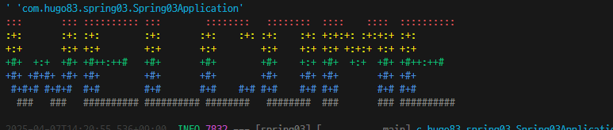

# java-springboot-2025

2025 java개발자 과정 레포지토리

## 1일차 (04-01)

### 웹 개요

- 구성 3단계
  - 브라우저(클라이언트/프론트엔드) - 사용자 **요청**을 하고, 그 결과를 돌려받는 파트
  - 서버(백엔드) - 사용자의 요청을 받아서 DB에서 데이터를 가져와 처리하고, 사용자에게 **응답**하는 파트
  - 데이터베이스 - 가장 중요한 데이터가 저장되어 있는 파트
- 웹 개념
  - 사용자 Request(요청)에 대한 서버의 Response(응답)

### Spring Boot 개요

- java - 컴퓨팅 세상 모든곳에서 사용될 수 있는 언어가 되고자 개발됨
- 웹 개발

  1. CGI(Common Gateway Interface) - HTTP 프로토콜에서 정적인 데이터만 전달할 수 있는 웹기술
  2. Servlet - CGI를 개선한 Java 웹기술. 동적웹을 개발할 수 있음
     - HTML코드를 전부다 Java에서 작성해야 함
  3. EJB(Enterprise Java Bean) - 서블릿으로 대형 프로젝트를 개발할 수 있는 Java 웹기술
     - 무지하게 복잡!
  4. JSP(Java Server Page) - 웹페이지 코드(HTML)에 자바코드를 포함시켜서 개발할 수 있는 Java 웹기술
     - 확장자가 .jsp/ 스파게티 코드
  5. Spring - Java웹개발에 전성기. 웹페이지와 자바영역 분리.
     - 설정이 복잡
  6. `Spring Boot` - Spring의 단접을 최소화. 설정을 간결화

- `Spring Boot`
  - Spring 기술을 그대로 사용(마이그레이션이 간단)
  - JPA 기술을 사용하면 ERD나 DB설계를 하지 않고도 손쉽게 DB를 생성
  - Tomcat Webserver가 내장!(설치 필요없음)
  - 서포트하는 기능 다수 존재(개발을 쉽게 도와줌)
  - 테스트용 JUnit, 로그용 Log4J2 모두 포함(설치 필요없음)
  - 프론트엔드를 다양하게 지원. JSP, **Thymeleaf**, Mustache 등
  - React 등의 자바스크립트 프론트엔드와 연계해서 풀스택 개발 가능
  - MVC(Model View Controller)로 영역을 분리, 각 부분별로 따로 개발

-MVC - view는 JSP포함, Thymeleaf, Mustach, HTML 등등


### Spring Boot 개발환경 설정

- 필요요소

  - Java, 개발 툴, 데이터베이스

- Java

  - java Runtime과 JDK(Java Developer Kit) 존재
    - Oracle 외에도 OpenJDK가 산재
    - https://jdk.java.net/
    - https://adoptium.net/
    - https://www.azul.com/downloads/?package=jdk#zulu
  - Java 17버전 이상설치
  - https://www.oracle.com/kr/java/technologies/downloads/archive/
  - jdk17 msi 다운로드

  - 시스템 정보(sysdm.cpl) 고급 > 환경변수 PATH 설정
    - 새로만들기
      - JAVA_HOME - 본인경로 입력
    - path에 %JAVA_HOME%\bin 추가, 맨 위로
  - powershell
    - java --version으로 확인

- VScode 확장 설치
  - Java 검색
    - Extension Pack for Java 설치, Debugger Pack for Java 등 7가지 설치

### 자바 기본실행

- VS Code에서 명령팔레트 실행 Ctrl+Shift+P
  - Java Create
    1. build tool 선택 > Maven
    2. No ArchType 선택
    3. Group ID 입력(com.example)
    4. Artifact ID 입력(demo)
    5. 저장위치 결정

### Spring Boot 설정

- VScode 확장 설치
  - Spring boot검색
    - Spring Boot Extension Pack 설치(추가 3개 확장 설치 됨)
  - Gradle 검색
    - Gradle for Java 설치

### Spring Boot 기본 실행

- JDK버전과 Spring Boot Initializr에 선택하는 JDK버전이 일치해야
  - OS에 JDK버전이 17버전이면 17선택
- VS Code에서 명령 팔레트 실행

  - Spring Initializr : Create a Maven Project
  - Specify Spring Boot version : 3.3.10 선택
  - Specify project language : Java 선택
  - Input Group ID : com.hugo83(각자 설정할것)
  - Inpur Arcifact ID : spring_01
  - Specify packaging type : Jar(Java archive, 압축파일)
  - Specify Java version : 17
  - Choose dependencise :
  - 저장위치
  - **새 창열기** - Spring Boot 프로젝트가 루트폴더가 된 개발 환경

- 실행 방법

  - 코드 작성
  - Spring Boot Dashboard > Apps > 앱 실행

- 기초문법
  - [자바기초문법](./Java_Basic.md)

## 2일차

- 기초문법 계속
  - [자바기초문법](./Java_Basic.md)
  - 흐름제어(반복문), 배열, 매서드, 객체/클래스, 상속

## 3일차

- 기초문법 계속
  - [자바기초문법](./Java_Basic.md)
  - 상속, 인터페이스, 예외처리, 제네릭, 컬렉션 프레임 워크, 입출력

### Spring Boot Tool

- 개요

  - 프로젝트 빌드 과정을 자동화 시켜주는 도구
  - 컴파일, 테스트, 패키징, 의존성 관리, 배포 등등

- Maven

  1. Java프로젝트 기본 빌드 도구
  2. Maven Repository https://mvnrepository.com/ 검색가능
  3. 빌드, 패키징(jar/war파일 생성, 테스트 등을 한번의 명령으로 간편하게 처리)
  4. 가장 큰 특징이 외부 라이브러리 자동으로 다운로드 및 관리
  5. pom.xml(Project Object Model) 파일로 빌드 설정 관리
     - 초기설정시 빠졌거나, 추가되어야 하면 xml 코딩으로 추가
  6. VSCode 확장 중 Maven Dependency Explorer 등으로 확인

- Gradle
  1. 안드로이드용 오픈소스 빌드도구
  2. Maven Repository를 같이 사용
  3. Maven의 3, 4번 특징을 그대로 가지고 있음
  4. build.gradle 파일 사용. groovy 스크립트 지원
  5. 빌드과정을 병렬처리, 캐싱사용으로 Maven보다 10~100배 향상된 성능

### Gradle 설정

- Gradle로 프로젝트가 제대로 동작하지 않으면
  - https://gradle.org/ 에서 Gradle 다운로드
  - 설치 경로 확인, 설치
  - 시스템 등록정보 PATH 지정. GRADLE_HOME 사용

### Spring Boot 로그 설정

- Spring Boot를 colorizing 해주는 기능
- src/resources/application.proweties

  ```shell
  spring.output.ansi.enable = always
  ```

## 4일차

- 기초문법 마무리
  - [자바기초문법](./Java_Basic.md)
  - C:\Gradle위치에 압축해제
  - sysdm.cpl환경변수 GRADLE_HOME 경로 입력, 확인(JAVA_HOME과 동일)
  - 이미지
  - VS Code 설정
  - 이미지
  - Gradle Bulid Server. Enabled 기본 on -> off
  - 이미지
  - Gradle Home -> 환경변수 입력한 GRADLE_HOME의 경로 입력
  - Gradle Java Home -> 환경변수 JAVA_HOME의 경로 입력
  - VS Code 재시작.

## 5일차

- Spring Boot 시작

  - Spring Initializr : Create a Gradle Project
  - Specify Spring Boot version : 3.4.4 선택
  - Specify project language : Java 선택
  - Input Group ID : com.hugo83(각자 설정할것)
  - Inpur Arcifact ID : spring_03
  - Specify packaging type : Jar(Java archive, 압축파일)
  - Specify Java version : 17
  - Choose dependencise : Selected 1 dependencies
    - Spring Web
  - 저장위치
  - **새 창열기** - Spring Boot 프로젝트가 루트폴더가 된 개발 환경

- 기본설정

  - application.properties에서 `spring.output.ansi.enabled=always` 입력

- 포트번호
  |프로토콜|포트번호|비고|
  |:---|---:|:---|
  |HTTP|80|웹 서버, 서비스포트(보안이 취약)|
  |HTTPS|443|SSL를 적용한 웹 서버(보안 강화)|
  |FTP|21|웹을 통한 파일전송|
  |TELNET|23|원격서버 접속 서비스|
  |SMPTP|25|메일 전송서비스|

- 개발용 포트

  - 포트는 중복안됨
  - 8080포트를 사용하고 있으면 다른 포트로 변경해야함!]

- 웹브라우저 열기
- https://localhost:8090/ 오픈

- 접속위치 요청 처리

  - 컨트롤러 생성

    - HelloController 클래스 생성
    - http://localhost:8090/hello

  - 각 기능별로 패키지를 구분
    - controller, model 등....

#### 로그출력

- Log-back

  - 스프링부트에 내장된 로그 모듈

  - application.properties 내 로그설정

  ```groovy
  logging.level.root = info
  logging.file.name = /logtest.log
  ```

  - 사용시

  ```java
  //클래스 내에 작성
  private final Logger logger = LoggerFactory.getLogger(this.getClass());

  //매서드 내 사용
  logger.info("hello URL 오픈!");
  //문제발생시 로그를 남길 떄
  logger.debug("디버그시 필요한 로그입니다");
  logger.trace("디버그시 필요한 로그입니다");

  logger.warn("경고표시 나타내는 로그입니다");
  logger.error("오류표시 나타내는 로그입니다");
  ```

- Log4J2 외부모듈 사용 권장

### 스프링부트 배너(중요도 없음)

- resource 폴더에 banner.txt 생성
- 내용 추가
- [Spring Boot Banner Generator](https://devops.datenkollektiv.de/banner.txt/index.html)
- 배너제너레이터로 생성한 글자 복사 Banner.txt 붙여넣기
- 서버 재시작



### 메인페이지 추가

- resource/static/index.html 부터 시작

### 스프링부트 프로젝트구조


- 각 폴더 구조
  - .gradle ~ gradle : 그레이들, VSCode, 빌드 등에 필요한 폴더(설명필요X)
  - `src/main/java` : 패키지와 자바 소스가 저장되는 위치
  - com.psc.spring03 : 패키지. 폴더로 구성
    - HelloController 클래스에 접근하여면
    - com.psc.spring03.controller.HelloController 접근해야 함
  - Spring04Application.java : 시작프로그램
  - src/main.resources : 자바파일 이외 HTML, CSS, JS, 환경파일 등 리소스파일 저장되는 위치
    - `static` : CSS, JS, 이미지 파일 저장되는 공간
    - `templates` : 스프링부트와 연계되는 HTML파일 저장되는 곳
    - `application.properties` : 프로젝트 환경설정 파일. 환경변수, DB 설정
  - src/test/java : JUnit 스프링부트 테스트도구 자바파일 저장되는 위치
  - `build.gradle` : 그레이들 환경 파일. Groovy 기반으로 한 빌드도구. dependencies만 잘 구성하면 됨
  - gradlaw.bat : 중간에 직접 그레이들 빌드를 할 때 사용하는 배치파일
  - setting.gradle : 고급 그레이들 설정. 손댈일 없음

### 스프링부트 어노테이션

#### @SpringBootApplication

- 스프링부트 자동구성 매커니즘 활성화
- 어플리케이션 내 패키지에서 컴포넌트들 스캐닝
- 설정 클래스 임포트해서 활성화, 스프링부트 실행

#### @Controller

- 컴포넌트 구체화 해서 해당클래스 IoC컨테이너 Bean으로 등록

#### @GetMapping

- Get, Post 중 Get(URL)으로 들어오는 주소를 매핑. 처리해주는 역할
- PostMapping, @RequestMapping 등 파악

#### @ResponseBody

- HTTP 요청의 자바객체가 처리한 body내용을 매핑하는 역할
- 자바의 String 문자열을 웹페이지에 랜더링.

## 6일차(6/30부터 재시작)

- Spring Boot JPS + Oracle + Thymeleaf + React
  <br>
  - JPA - DB설계 없이 엔티티 클래스만으로 테이블을 자동 생성해주는 기술. SQL도 사실상 필요없음
    - JPA 이전 - MyBaties. SQL + XML로 구성된 ORM 기술(Object Ralational Mapping) 기술
  - H2 - Oracle, MySQL 등과 달리 인메모리DB. Spring Boot에서 자동으로 실행해주는 DB
    - 개발할 때 사용. 운영시 이전할 때 DB 종류에 관계없이 이전이 가능. 개발동한 사용
  - Thymeleaf - JSP 단점을 보안한 템플릿 형태 FE 개발방식
    - Bootstrap은 필수로 사용
  - 소셜로그인 - 구글, 카카오, 네이버 SSO 로그인 연동(OAuth 2.0)
  - React - FE를 완전 분리
    <br>
- Spring Boot 프로젝트 생성
  <br>
  1. 명령 팔레트 시작(Ctrl + Shift + P) Spring Initializr : Create a Gradle(Maven) Project
  2. Spring Boot version : 3.5.3
  3. Project Language : Java
  4. Group Id : com.pknu
  5. Artifact Id : backboard
  6. package type : Jar
  7. Java version : 17
  8. Dependency
     - Spring boot DevTools : 개발시 필요한 명령어, 기능 포함
     - Lombok : 어노테이션 등 편리하게 해주는 플러그인 라이브러리
     - Spring Web : 프론트엔드(html) 개발을 할 때 필요한 의존성
     - Thymeleaf : html + Spring Boot 태그 매핑을 해주는 기능
     - H2 Database(later) : 개발동안 필요한 인메모리 DB
     - Oracle Driver(later) : 실제 운용할 DB
     - Spring Data JPA(later) : DB 생성 + ORM
  9. 저장 위치 지정, Genelate into this folder 선택
  10. 오른쪽 하단 프로젝트 폴더 Open 버튼 클릭
      <br>
- Spring Boot BackBoard Project
  <br>
  - Gradle plugin - Dependency 파악. 프로젝트 업데이트
  - Spring Boot DashBoard - 프로젝트 실행
    <br>
- Spring Boot 설정파일
  - build.gradle - 그레이들에서 설정할 구성내용
  - application.properties - Spring Boot 프로젝트 자체 설정파일
  - settings.gradle, gradle-wrapper.properties - 손댈일 없음
    <br>

### 스프링부트 BackBoard 프로젝트

1.  기본실행
    <br>
    1. resoucer/application.properties
       <br>
    ```properties
    - server.port=9097 # 포트변경
    - spring.output.ansi.enabled=always # 로그 색상 설정
    - logging.level.root-info # 로그 출력레벨 설정
    - loggin.file.name=C:/temp/backboard/log 로그파일 위치
    ```
    <br>
    2. build Gradle
    <br>
    ```gradle
    // DB연동성 의존성
    runtimeOnly 'com.h2database:h2' //개발시에만 사용하는 InmemoryDB H2
    implementation 'org.springframework.boot:spring-boot-starter-data-jpa'
    ``` 
    <br>
    3. Controller 작업
    <br>
       - MainController 생성
       - 새 파일로 생성 / java class 생성 둘 다 동일
    <br>
    4. /resouces/templates/ 에 Mapping 매서드 리턴값과 동일한 HTML작성
    <br>
2.  DB연동
    <br>

    1. H2 DB 의존성 추가
    2. appliaction.properties에 H2관련 의존성 추가

       ```properties
       ## H2 DB작성
       spring.h2.console.enabled=true
       ##접속 URL
       spring.h2.console.path=/h2-console
       # H2 파일위치
       ## JDBC URL
       spring.datasource.url=jdbc:h2:./local
       spring.datasource.driver-class-name=org.h2.Driver
       spring.datasource.username=sa
       spring.datasource.password=
       ```

    3. http://localhost:9097/h2-console

       

    4. appliaction.properties에 JPA 설정
       <br>

    ```properties
    ##JPA
    spring.jpa.properties.hibernate.dialect=org.hibernate.dialect.H2Dialect
    spring.jpa.hibernate.ddl-auto=update
    ```

    <br>
    - JPA 등의 ORM작업시 사용하는 기술 - 하이버네이트
    - spring.jpa.hibernate.ddl-auto 종류
        <br>
      - create : SB 서버 시작시 테이블을 모두 삭제 후 다시 재생성(데이터 모두 휘발)
      - create-drop : create와 동일 + 서버가 종료되면 테이블 모두 삭제
      - `update` : 엔티티 변경부분만 적용. 원래 있던 데이터는 존재
      - `validation` : 엔티티와 테이블간 차이점 검사만
      - truncate : 데이터를 전부 날림
      - none : 엔티티가 변경되어도 DB는 변경하지 않음

    5.  MVC 패턴에 맞춰 각 기능별로 패키지(폴더) 생성

        1. controller, entity, repository, sevice

    6.  @(Annotation) 정리
        <br>
        - Lombok
          - `@Getter` : getter 매서드 자동 생성
          - `@Setter `: setter 매서드 자동 생성
            <br>
        - JPA
          - `@Entity` : 테이블화 할 객체 선언
          - `@Id `: 테이블 PK -` @GeneratedValue(strategy = GenerationType.AUTO)`
            - AUTO : MySQL Auto Increment
            - IDENTIFY : SQLServer Identify(1, 1)
            - SEQUENCE : Oracle Sequence
            - H2 DB를 오라클 타입으로 사용하고, 나중에 운영DB를 오라글로 갈아타겠다!
              <br>
          - `@Column` : 컬럼의 속성을 변경(ex: @Column(name="subject", length=250))
            - name : DB상의 실제 컬럼명을 엔티티와 다르게 사용할 때
            - length : 길이를 지정
            - updatable : 최초 작성이휴 수정여부. false는 수정불가
            - columnDefinition : "TEXT" MySQL, "CLOB" Oracle. H2는 사용불가
              <br>
        - SpringFramework
          - @CreateDate : 생성일
          - @LastModifyDate : 최종 수정일에 대한 어노테이션
            <br>
    7.  entity 작성
        <br>
        1. 테이블로 생성할 Board 클래스 생성
        2. Lombok에 @Getter, @Setter를 사용하면 get~,set~ 매서드를 작성할 필요가 없다(소스코드를 줄여줌)
           <br>
    8.  repository 작성
        <br>

        1. DB상의 데이터를 조회, 저장, 수정, 삭제할 수 있게 도와주는 인터페이스
        2. SELECT -> findAll() / INSERT -> save() 등 매서드를 기본 제공
        3. 단위테스트

           ```gradle
           // JUnit 단위테스트
           testImplementation 'org.junit.jupiter:junit-jupiter'
           ```

        4. SELECT, SELECT ... WHERE 단위 테스트
        5. 디버그콘솔에서 쿼리 로그로 확인. application.preperties 설정추가

           ```properties
           # 테스트시 쿼리 확인
           spring.jpa.properties.hibernate.format_sql=true
           spring.jpa.properties.hibernate.show_sql=true
           ```

        6. SELECT ... WHERE LIKE, DELETE FROM 단위 테스트

## 7일차(07-01)

### 스프링부트 BackBoard 프로젝트(계속)

1. 단위 테스트

   1. UPDATE 테스트

2. DB연동 개발 계속

   1. Entity 중 Board(게시글)의 댓글 Reply 클래스 생성
   2. DB ERD에서 Board : Reply => 1:N(1대 다)를 관계를 가짐
   3. @(Annotation) 추가
      - @OneToMany(mappedBy = "board", cascade = CascadeType.REMOVE) : 1대다 ERD 관계로 부모클래스(테이블) 에 작성하는 부분
      - @ManyToOne : 다대1 ERD관계로 자식 클래스에 작성하는 부분
      - @Service : 서비스 모듈을 지정
      - @RequiredArgsConstructor : 생성자를 만들어줌. 파라미터가 존재하는 생성자를 자동으로 생성(Lombok)
      - @NoArgsConstructor : 파라미터가 없는 빈 생성자를 자동으로 생성(Lombok)
   4. ReplyRepository 인터페이스 작성
   5. Service 작성
      - 데이터 처리를 위해서 작성하는 클래스. MVC, 패턴처럼 모듈화로 복잡한 코드를 단순화, 역할분리를 위해서 만듬
      - Controller는 게이트(문). 사용자가 접속을 해서 요청하는 부분
   6. Entity를 DTO 객체 변환

      - Entity : DB와 직접적으로 연결되어있는 클래스. 이 객체를 그대로 사용해서 FE로 보내는 방식이 좋지 않음(보안적인 문제 등)
      - DTO사용은 옵션으로 할 수 있음

   7. BoardController 작성
   8. /templates/board_list.html 생성

      - thymeleaf 문법적용

   9. 상세 페이지 작업

      - Service, Controller 메서드 작업

   10. 상세페이지에 댓글 저장 기능 추가

       - board.detail.html에 댓글 저장 폼양식 추가
       - ReplyService, ReplyController 작성

3. thymeleaf 문법

   - ${} : 변수표현식. 변수에 들어있는 값을 화면에 표시하는 기능.
   - @{} : URL링크 표현식. 정적인 링크 또는 라우팅 되는 경로를 생성하는 기능
   - #{} : 메세지 표현식
   - thymeleaf 속성에만 사용가능 : th:text, th:href ...

4. 웹페이지 디자인

   1. resource/static : css, js, 정적 HTML이 위치
   2. static/ main.css : 전체에서 사용할 css 파일 위치
   3. 부트스트랩 적용
      - https://getbootstrap.com/
   4. board_detail.html : 부트스트랩 적용

5. 전체 HTML에 디자인 적용
   1. build.gradle에 thymeleaf-layout 의존성 추가
      ```gradle
      // Thymeleaf layout 의존성 추가. 250701. 신규추가
      implementation 'nz.net.ultraq.thymeleaf:thymeleaf-layout-dialect'
      ```
   2. 레이아웃 템플릿 페이지 작성
   3. board_list.html에 적용
https://github.com/user-attachments/assets/28135c5b-7310-4e1a-ab99-84a464f9e366


    
